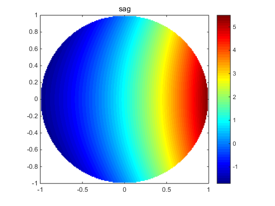
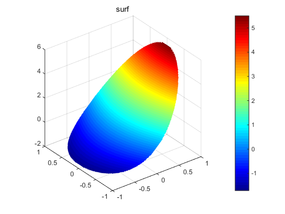

# ZernikeFreeformSurfacePlot
Zernike FreeForm Surface Plotting. 使用CodeV或Zemax优化得到的Zernike系数仿真镜面

function zernikeFromCoeff(coef, c, k, type, titleSag, titleSurf)
求出的参数；c:曲面顶点处的曲率；k:圆锥曲面系数；titleSag：平面图的标题；titleSurf：三维图的标题；type：一般zernike(0)或XY(1)

example:
```matlab
coef = [3.608, -0.00519, 0.89, -0.00050];
c = 0.001994;
k = -5.6933;
titleSag = 'sag';
titleSurf = 'surf';
zernikeFromCoeff(coef, c, k, 0, titleSag, titleSurf)
```




>References: 
>[1] 刘军. 自由曲面在成像光学系统中的研究[D]. 中国科学院研究生院(长春光学精密机械与物理研究所), 2016.
>[2] 王超. 自由曲面表征函数及其应用研究[D]. 中国科学院研究生院(长春光学精密机械与物理研究所), 2014.
